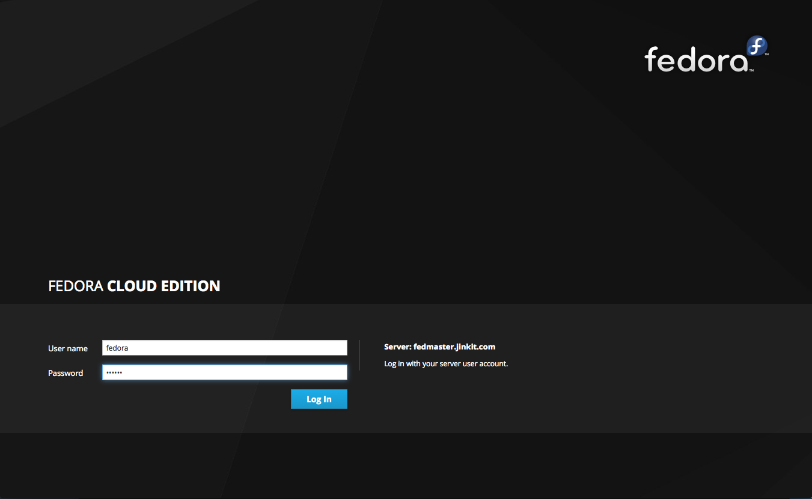
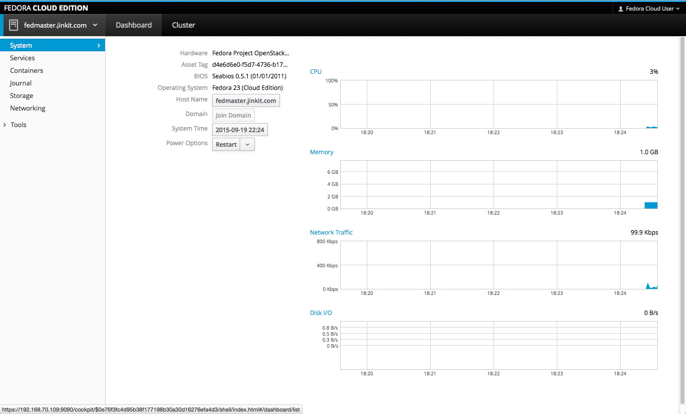
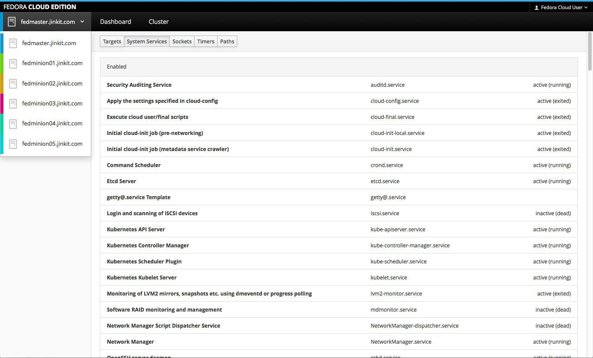
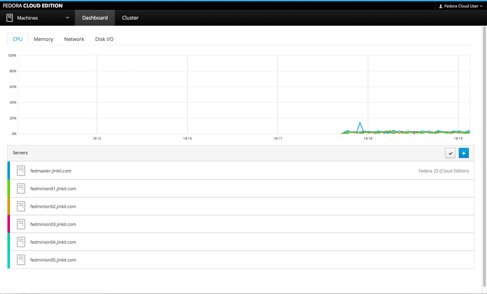
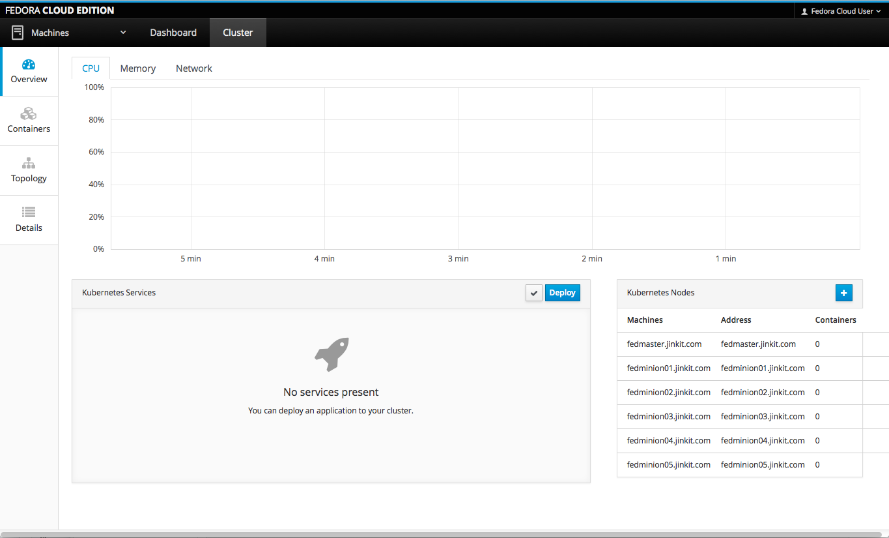
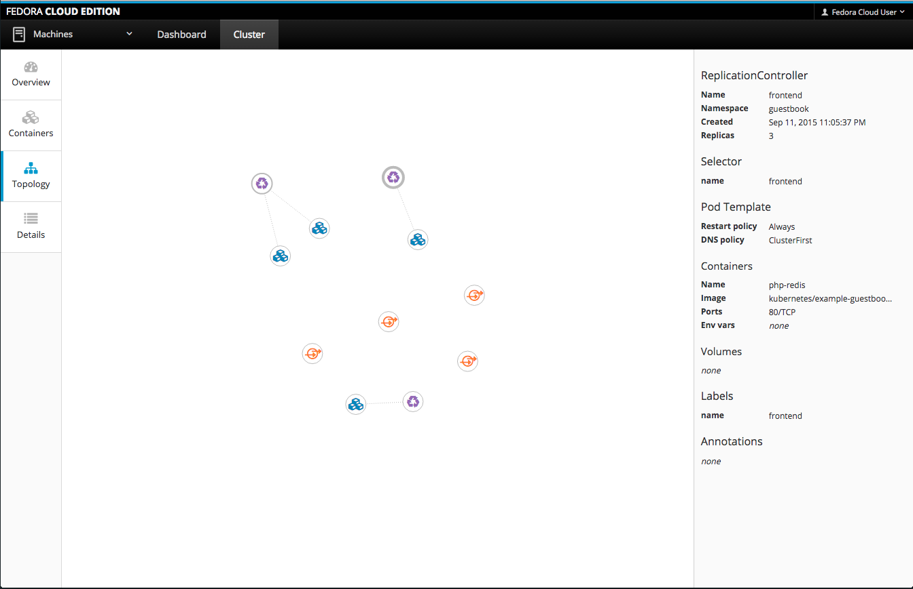
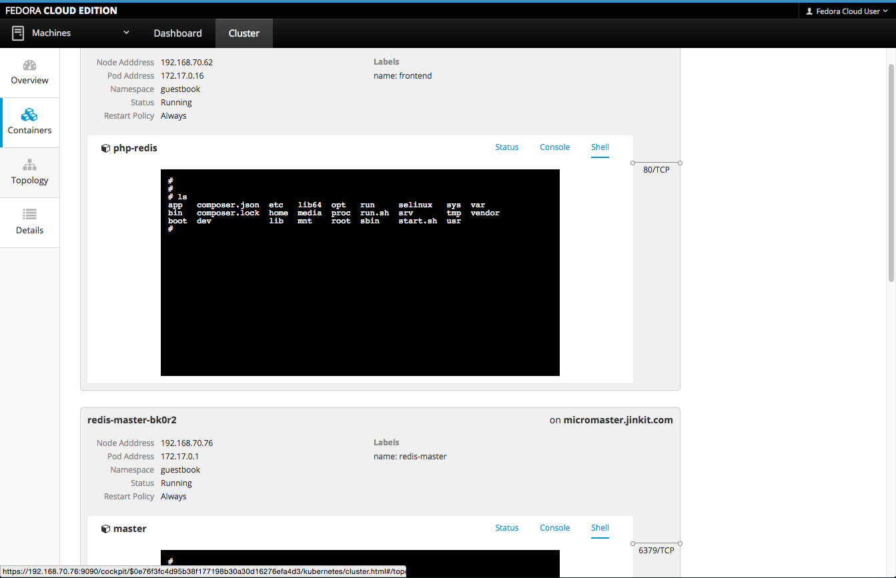
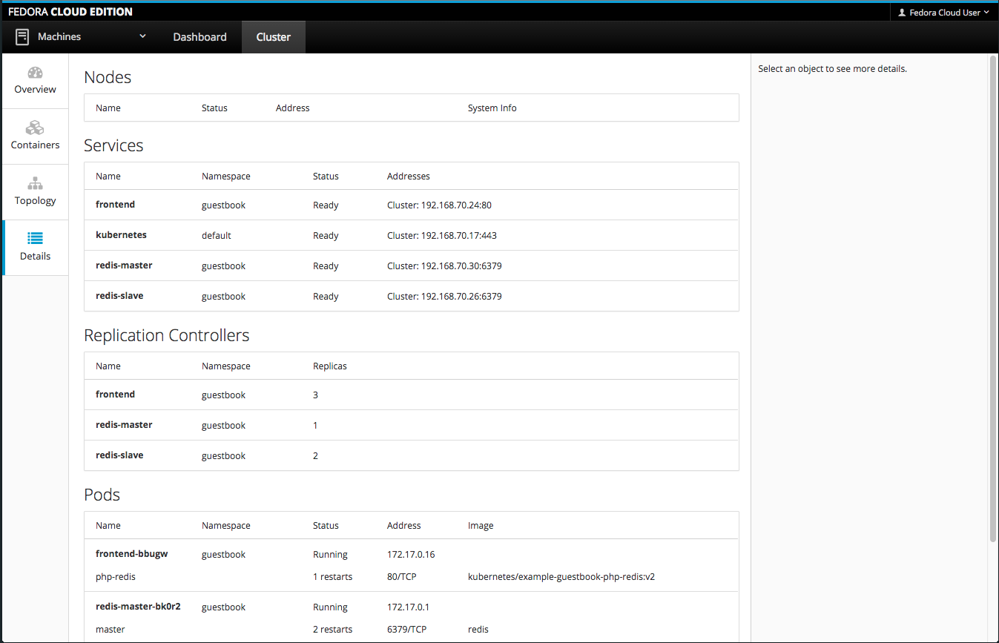
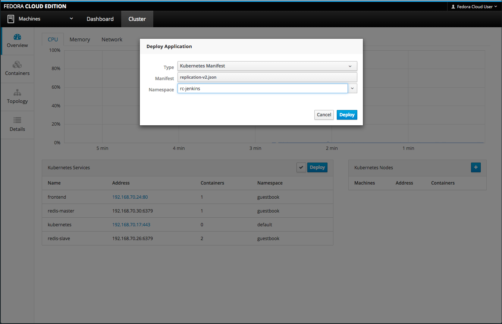

# Basic Kubernetes Lab and Various Tests

## The Skinny
Use this repo as a set of examples. I've uploaded a set of working configurations for one Master and 5 nodes in a lab using Fedora and Atomic images. I'll eventually clean up this repo and make it more useful later (this was thrown up quickly).

* kubemaster
* kubeminion01-05
* kubelb01-02

## The Lab
Lab environment is found in the `kube-config` directory.

## Demo Files
Demo files are located in the `jinkit-demo` directory. Most of the demo's are taken from the upstream Kubernetes project. I would strongly suggest using their vagrant lab first, as it has working DNS, TLS and some other nice additions. It's a complete solution. To take things further, I have included configurations for Kubernetes in an Atomic environment. Atomic has some interesting features including RPM-OSTree and Cockpit. Please review documentation at http://www.example.com/kubernetes-lab-for-openstack/ for more information.

So now we get to have some fun. If you're new to Openstack or Microservices, I would suggest that you read [Part 1](http://www.example.com/kubernetes-for-anyone/) before taking on this task. There have been a lot of people who have tried to learn Kubernetes with great intentions and have ultimately become frustrated with the overabundance of information, bringing their journey to an unhappy end. The purpose of this article is to help folks learn Kubernetes in a repeatable fashion, so they can install the environment (hopefully using my Openstack deployment recommendations), destroy it, and start all over again. It's the whole [growth mindset](http://mindsetonline.com/whatisit/about/index.html) attitude.

## Getting Started
The first thing you will need to do is obtain the images used for your Openstack environment. We are going to use two different instances, both of which are Red Hat variants.

* [Fedora Base 23 Alpha](https://getfedora.org/en/cloud/prerelease/) <br>
`Fedora-Cloud-Base-23_Alpha-20150806.2.x86_64.qcow2`
* [CentOS Atomic Host](https://wiki.centos.org/SpecialInterestGroup/Atomic/Download/)<br>
`CentOS-Atomic-Host-7.20150908-GenericCloud.qcow2`

I ***must*** mention that these images are aggressive development builds; they're beta and may deviate from this walkthrough at any given time! Please look at the date of this article for reference, but I'll tell you the key things we'll need from these images:

At the time of writing, there are two versions of Kubernetes available. We're going to pick **only** v1.1.0 Release 0.5. There are reasons we'll get to later.

```
[fedora@kubemaster ~]$ sudo dnf info kubernetes
Last metadata expiration check performed 0:53:16 ago on Sat Sep 19 19:33:36 2015.
Installed Packages
Name        : kubernetes
Arch        : x86_64
Epoch       : 0
Version     : 1.1.0
Release     : 0.5.gite44c8e6.fc23
Size        : 0.0
Repo        : @System
From repo   : fedora
Summary     : Container cluster management
URL         : k8s.io/kubernetes
License     : ASL 2.0
Description : Container cluster management

Available Packages
Name        : kubernetes
Arch        : x86_64
Epoch       : 0
Version     : 1.1.0
Release     : 0.16.git388061f.fc23
Size        : 33 k
Repo        : updates-testing
Summary     : Container cluster management
URL         : k8s.io/kubernetes
License     : ASL 2.0
Description : Container cluster management

[fedora@kubemaster ~]$
```

The second really important part is the Kubernetes plug-in for Cockpit. It's not really needed, but it's an impressive piece of work that Red Hat has been putting together, based on the Kubernetes API:

```
[fedora@kubemaster ~]$ sudo dnf info cockpit-kubernetes
Last metadata expiration check performed 0:57:18 ago on Sat Sep 19 19:33:36 2015.
Installed Packages
Name        : cockpit-kubernetes
Arch        : x86_64
Epoch       : 0
Version     : 0.74
Release     : 1.fc23
Size        : 79 k
Repo        : @System
From repo   : updates-testing
Summary     : Cockpit user interface for Kubernetes cluster
URL         : http://cockpit-project.org/
License     : LGPLv2+
Description : The Cockpit components for visualizing and configuring a Kubernetes
            : cluster. Installed on the Kubernetes master. This package is not yet complete.

[fedora@kubemaster ~]$
```

And to give you a point of reference, here are some details about Cockpit:

```
[fedora@kubemaster ~]$ sudo dnf info cockpit
Last metadata expiration check performed 0:57:52 ago on Sat Sep 19 19:33:36 2015.
Installed Packages
Name        : cockpit
Arch        : x86_64
Epoch       : 0
Version     : 0.74
Release     : 1.fc23
Size        : 35 k
Repo        : @System
From repo   : updates-testing
Summary     : A user interface for Linux servers
URL         : http://cockpit-project.org/
License     : LGPLv2+
Description : Cockpit runs in a browser and can manage your network of GNU/Linux
            : machines.

[fedora@kubemaster ~]$
```

Also, let's cover the players...etcd

```
[fedora@kubemaster ~]$ sudo dnf info etcd
Last metadata expiration check performed 0:58:36 ago on Sat Sep 19 19:33:36 2015.
Installed Packages
Name        : etcd
Arch        : x86_64
Epoch       : 0
Version     : 2.0.13
Release     : 3.fc23
Size        : 17 M
Repo        : @System
From repo   : fedora
Summary     : A highly-available key value store for shared configuration
URL         : https://github.com/coreos/etcd
License     : ASL 2.0
Description : A highly-available key value store for shared configuration.

[fedora@kubemaster ~]$
```
...Docker...
```
[fedora@kubemaster ~]$ sudo dnf info docker
Last metadata expiration check performed 0:59:18 ago on Sat Sep 19 19:33:36 2015.
Installed Packages
Name        : docker
Arch        : x86_64
Epoch       : 1
Version     : 1.8.2
Release     : 2.gitd449443.fc23
Size        : 29 M
Repo        : @System
From repo   : updates-testing
Summary     : Automates deployment of containerized applications
URL         : http://www.docker.com
License     : ASL 2.0
Description : Docker is an open-source engine that automates the deployment of any
            : application as a lightweight, portable, self-sufficient container that will
            : run virtually anywhere.
            :
            : Docker containers can encapsulate any payload, and will run consistently on
            : and between virtually any server. The same container that a developer builds
            : and tests on a laptop will run at scale, in production*, on VMs, bare-metal
            : servers, OpenStack clusters, public instances, or combinations of the above.

[fedora@kubemaster ~]$
```
...and Flannel...
```
[fedora@kubemaster ~]$ sudo dnf info flannel
Last metadata expiration check performed 1:00:15 ago on Sat Sep 19 19:33:36 2015.
Installed Packages
Name        : flannel
Arch        : x86_64
Epoch       : 0
Version     : 0.5.1
Release     : 3.fc23
Size        : 7.7 M
Repo        : @System
From repo   : fedora
Summary     : Etcd address management agent for overlay networks
URL         : https://github.com/coreos/flannel
License     : ASL 2.0
Description : Flannel is an etcd driven address management agent. Most commonly it is used to
            : manage the ip addresses of overlay networks between systems running containers
            : that need to communicate with one another.

[fedora@kubemaster ~]$
```

So those are the key players. Use this information to be more successful in your deployment! Again, things can break at any given point.

## Creating the foundation
So hopefully you've downloaded the images. I am going to cover the Openstack method using the qcow2 images listed above rather than the Vagrant boxes, which I'll get to some other day.

1. Create a file called `atomic-cloud-config.yaml` and enter the following information:

        [bjozsa@galvatron projects]# vi atomic-cloud-config.yaml
        #cloud-config
        hostname: <hostname>.example.com
        password: atomic
        ssh_pwauth: True
        chpasswd: { expire: False }
        ssh_authorized_keys:
        - ssh-rsa <public-key>
(where `<public-key>` is your public-key hash)

2. Make sure to use your `~/keystonerc_admin` file to set the environment variables you'll need to work with and configure Openstack (additionally, make sure that `keystonerc_admin` is configured correctly for your tenant/project name):

        [bjozsa@galvatron projects]# . /home/bjozsa/keystonerc_admin

3. Next, make sure you understand your environment, but using the following commands:
 * openstack image list = `<IMAGE>`
 * openstack keypair list = `<KEYPAIR-NAME>`
 * openstack flavor list = `<FLAVOR-ID-NUMBER>`
 * openstack security group list = `<SECGRP>` (can be more than one separated by an inline comma; example `<SECGRP1>`,`<SECGRP2>`)
 * openstack network list = `<NET-ID>` (more than one example `<NET1>`, `<NET2>`, etc)

4. Then, put it all together with nova boot:

        [bjozsa@galvatron projects(keystone_admin)]# nova boot --image <IMAGE> --key-name <KEYPAIR-NAME> --flavor <FLAVOR-ID-NUMBER> --security-group <SECGRP1>,<SECGRP2> --nic net-id=<NET1> --nic net-id=<NET2> --user-data atomic-cloud-config.yaml <hostname>

5. Now, you're going to bring up one instance of a `master`, which you will use the Fedora 23 image for. The `minions` (actually, Kubernetes calls them nodes now) will be created from the CentOS Atomic image.

 * Master = Fedora 23 Cloud Base (1)
 * Docker Cache = CentOS Atomic (1)
 * Nodes/Minions = CentOS Atomic (5)

## Create a Docker Repository Mirror
Now, I created my own Docker Registry caching server (which is coincidently run from a container in CentOS Atomic). What this does is force my minions to obtain docker images from the same controlled source, and it allows images to be reused quicker then they would be if I had to fetch them for each pod turn up. Just think about it for a second; you build this ultra-flexible containerized network, but you're delayed every single time you need to fetch images directly from Docker Hub. Na...no thanks! I prefer to load them once, cache them, and then when my pods are killed and brought back up (think about rolling updates, or when a pod is brought down by Kubernetes), the start-up time is drastically reduced.

1. In order to do this, you will need to bring up another CentOS Atomic instance. After the instance is up, run the following command to start the container:

        [centos@microhub ~]$ sudo docker create -p 5000:5000 -v /var/lib/local-registry:/srv/registry -e STANDALONE=false -e MIRROR_SOURCE=https://registry-1.docker.io -e MIRROR_SOURCE_INDEX=https://index.docker.io -e STORAGE_PATH=/srv/registry --restart=always --name=local-registry registry:2

2. I then created a service for this Docker container, and named it `local-registry.service`:

        [centos@microhub ~]$ sudo vi /etc/systemd/system/local-registry.service
        :1,$d
        i[Unit]
        Description=Local Docker Mirror registry cache
        Requires=docker.service
        After=docker.service

        [Service]
        Restart=on-failure
        RestartSec=10
        ExecStart=/usr/bin/docker start -a %p
        ExecStop=-/usr/bin/docker stop -t 2 %p

        [Install]
        WantedBy=multi-user.target

3. Reload the systemctl daemon

        [centos@microhub ~]$ sudo systemctl daemon-reload

4. Enable [for reboot], start, and status  the service:

        [centos@microhub ~]$ sudo systemctl start local-registry

5. Change the security context for the service:

        [centos@microhub ~]$ sudo chcon -Rvt svirt_sandbox_file_t /var/lib/local-registry

And that's it! Point your Master/Minions to this caching server in order to speed up your Kubernetes pod startup/load times.

## Create the Kubernetes Master
Hopefully all of your instances built without issues. Everything should have gone pretty smoothly, but if they didn't...don't sweat it! Delete them and start over! That's the great thing about having a home lab, nobody cares if you blow it up and it's a great place to learn.

So if you've gotten this far, you're ready to continue setting up your Kubernetes Master.

1. Log into your Kubernetes Master (we're going to call this `kubemaster` from now on):

        ssh -i ~/<key> fedora@192.168.1.xx
Note: `fedora` is the default username for the Fedora 23 Alpha image.

2. In your instance, you'll notice that `firewalld` is not enabled on Fedora 23 Alpha by default. In case this gets turned on in the future, perform the following commands to disable it:

        sudo systemctl disable firewalld
        sudo systemctl stop firewalld
        sudo systemctl status firewalld
3. Turn SELinux to "permissive" if you are using this in a testing environment. (I'm sure the Atomic/RH guys are rolling their eyes right now).

        sudo vi /etc/sysconfig/selinux
        # This file controls the state of SELinux on the system.
        # SELINUX= can take one of these three values:
        #     enforcing - SELinux security policy is enforced.
        #     permissive - SELinux prints warnings instead of enforcing.
        #     disabled - No SELinux policy is loaded.
        SELINUX=permissive
        # SELINUXTYPE= can take one of three two values:
        #     targeted - Targeted processes are protected,
        #     minimum - Modification of targeted policy. Only selected processes are protected.
        #     mls - Multi Level Security protection.
        SELINUXTYPE=targeted

4. Perform an update (This is where things could get risky, but it needs to be done.)

        sudo dnf -y update

5. Reboot.

        sudo reboot

6. Install Prerequisites, but ***note(!)*** this is where you can potentially run into issues.

 **Option A:** In case Kubernetes is broken in Fedora Base 23 (as it is in v1.1.0 Release 0.16). This is the state as of Sept 18th 2015. I told the Fedora team about it over IRC, but they weren't interested at all!

        sudo dnf install -y flannel etcd docker cockpit
        sudo dnf --disablerepo=updates-testing install kubernetes cockpit-kubernetes

 **Option B:** If you want to take your chances! With this option, you will get the latest updates available, but you may have to later remove broken package, and rerun the installation using the command above (referring to disabling the repo: `--disablerepo=updates-testing`).

        sudo dnf install -y flannel kubernetes cockpit cockpit-kubernetes etcd docker

7. Enable some of the services on reboot:

        sudo systemctl enable docker cockpit.socket
        sudo systemctl start docker cockpit.socket
        sudo systemctl status docker cockpit.socket

 Verify this all works correctly with your `status` command.

8. Create a hosts file that makes sense for your environment, like so:

        sudo vi /etc/hosts
        :1,$d
        i# Example Kubernetes Hosts
        127.0.0.1   localhost localhost.localdomain localhost4 localhost4.localdomain4
        ::1         localhost localhost.localdomain localhost6 localhost6.localdomain6
        #
        # Kubernetes Local Docker Repository Mirror
        192.168.70.83  microhub.example.com microhub
        #
        # Kubernetes Backend Storage Server
        192.168.70.82  microstore.example.com microstore
        #
        # Kubernetes Masters
        192.168.70.76 kubemaster.example.com kubemaster
        192.168.70.109 fedmaster.example.com fedmaster
        #
        # Kubernetes Minions
        192.168.70.77 kubenode01.example.com kubenode01
        192.168.70.78 kubenode02.example.com kubenode02
        192.168.70.79 kubenode03.example.com kubenode03
        192.168.70.80 kubenode04.example.com kubenode04
        192.168.70.81 kubenode05.example.com kubenode05
        192.168.70.82 kubenode06.example.com kubenode06

9. Following the instructions from the [Atomic Getting Started Guide](http://www.projectatomic.io/docs/gettingstarted/), change two lines in the `/etc/etcd/etcd.conf` file:

        sudo vi /etc/etcd/etcd.conf
        ETCD_LISTEN_CLIENT_URLS="http://0.0.0.0:2379,http://0.0.0.0:4001"
        ETCD_ADVERTISE_CLIENT_URLS="http://0.0.0.0:2379,http://0.0.0.0:4001"

10. Edit the Kubernetes configuration file:

        sudo vi /etc/kubernetes/config
        :1,$d
        i# JinkIT Kubernetes Master Config
        KUBE_LOGTOSTDERR="--logtostderr=true"
        KUBE_LOG_LEVEL="--v=0"
        KUBE_ALLOW_PRIV="--allow_privileged=false"
        KUBE_MASTER="--master=http://192.168.70.76:8080"
        KUBE_ETCD_SERVERS="--etcd_servers=http://192.168.70.76:2379"

11. Edit the Kubernetes API configuration file:

        sudo vi /etc/kubernetes/apiserver
        :1,$d
        iKUBE_API_ADDRESS="--insecure-bind-address=0.0.0.0"
        # KUBE_API_PORT="--port=8080"
        # KUBELET_PORT="--kubelet-port=10250"
        KUBE_ETCD_SERVERS="--etcd-servers=http://127.0.0.1:2379"
        KUBE_SERVICE_ADDRESSES="--portal_net=10.62.0.0/16"
        KUBE_ADMISSION_CONTROL="--admission-control=NamespaceLifecycle,NamespaceExists,LimitRanger,SecurityContextDeny,ResourceQuota"
        KUBE_API_ARGS="--runtime_config=api/v1beta3"

12. Edit the Kubernetes Controller configuration file:

        sudo vi /etc/kubernetes/controller-manager
        :1,$d
        i# JinkIT Kubernetes Lab Master/Minion Definitions
        KUBE_CONTROLLER_MANAGER_ARGS=""
        KUBELET_ADDRESSES="--machines=192.168.70.76,192.168.70.77,192.168.70.78,192.168.70.79,192.168.70.80,192.168.70.81"

13. Edit the Controller Minion Configuration file:

        sudo vi /etc/kubernetes/kubelet
        :1,$d
        i# JinkIT Kubernetes Lab Minion Configuration File
        KUBELET_ADDRESS="--address=0.0.0.0"
        # KUBELET_PORT="--port=10250"
        KUBELET_HOSTNAME="--hostname-override=kubemaster.example.com"
        KUBELET_API_SERVER="--api-servers=http://127.0.0.1:8080"
        KUBELET_ARGS="--api_servers=127.0.0.1:8080"

 NOTICE: We're also making our `master` a `minion` in this case. That's perfectly fine for testing and to see Atomic Cockpit in action (which you're going to really like).

14. Enable, Start, and Stat the Kubernetes services:

        sudo systemctl enable etcd kube-apiserver kube-controller-manager kube-scheduler kubelet
        sudo systemctl start etcd kube-apiserver kube-controller-manager kube-scheduler kubelet
        sudo systemctl status etcd kube-apiserver kube-controller-manager kube-scheduler kubelet

15. Now we're going to configure Flannel. Create the flanneld configuration file (in your /home directory):

        vi ~/flanneld-conf.json
        i{
          "Network": "172.16.0.0/12",
          "SubnetLen": 24,
          "Backend": {
            "Type": "vxlan"
          }
        }

16. Upload the configuration file to etcd. You ***MUST*** take note of the /keys/<HERE>/network identifier! Make this unique to your configuration.

        curl -L http://localhost:2379/v2/keys/<custom-value>/network/config -XPUT --data-urlencode value@flanneld-conf.json

17. Finally, test the etcd key:

        curl -L http://localhost:2379/v2/keys/<custom-value>/network/config | python -m json.tool

## Create the Kubernetes Minions
The minions (or nodes; I'm still getting used to this change, and really, minions just sound cooler) are much easier and somewhat repetitive.

1. Log into each of your Kubernetes Minions (we're going to call these `kubenode0x` from now on, and we'll create 5 of them):

        ssh -i ~/<key> centos@192.168.1.xx
Note: `centos` is the default username for the CentOS Atomic image.

2. Create your `/etc/hosts` file:

        sudo vi /etc/hosts
        :1,$d
        i# JinkIT Kubernetes Hosts
        127.0.0.1   localhost localhost.localdomain localhost4         localhost4.localdomain4
        ::1         localhost localhost.localdomain localhost6 localhost6.localdomain6
        #
        # Kubernetes Master
        192.168.70.76 kubemaster.example.com fedmaster
        #
        # Docker Hub (Caching Server)
        192.168.70.83 microhub.example.com microhub
        #
        # Kubernetes Minions
        192.168.70.77 kubenode01.example.com kubenode01
        192.168.70.78 kubenode02.example.com kubenode02
        192.168.70.79 kubenode03.example.com kubenode03
        192.168.70.80 kubenode04.example.com kubenode04
        192.168.70.81 kubenode05.example.com kubenode05

3. Point to the Docker Registry Caching Server we set up earlier:

        sudo vi /etc/sysconfig/docker
        :1,$d
        i# JinkIT Kubernetes Docker Configuration /etc/sysconfig/docker
        # ADD_REGISTRY='--add-registry registry.access.redhat.com'
        # BLOCK_REGISTRY='--block-registry'
        # INSECURE_REGISTRY='--insecure-registry'
        # setsebool -P docker_transition_unconfined 1
        # DOCKER_TMPDIR=/var/tmp
        # LOGROTATE=false
        #
        # JinkIT Kubernetes Options
        OPTIONS='--registry-mirror=http://microhub.example.com:5000 --selinux-enabled'
        DOCKER_CERT_PATH=/etc/docker

4. Configure flanneld to communicate with your `master`:

        sudo vi /etc/sysconfig/flanneld
        :1,$d
        i# JinkIT Kubernetes flanneld Configuration
        FLANNEL_OPTIONS="eth0"
        FLANNEL_ETCD="http://kubemaster.example.com:2379"
        FLANNEL_ETCD_KEY="/<custom-value>/network"

 Note: Again, you will need to pay attention to the `<custom-value>` value and create your own!

5. Next, configure your Kubelet configuration file:

        sudo vi /etc/kubernetes/kubelet
        :1,$d
        i# JinkIT Kubernetes Minion Configuration
        # KUBELET_PORT="--port=10250"
        KUBELET_ADDRESS="--address=192.168.70.77"
        KUBELET_HOSTNAME="--hostname_override=kubenode01.example.com"
        KUBELET_API_SERVER="--api_servers=http://kubemaster.example.com:8080"
        KUBELET_ARGS="eth0

 Note: Throughout this lab walkthrough I've tried to use DNS where it can be used. For the Kubelet configuration, make sure that you use IP addresses where I have them identified. I've tested using named values, and they work just as I have them.

6. Finally, edit the Kubernetes configuration file:

        sudo vi /etc/kubernetes/config
        :1,$d
        i# JinkIT Kubernetes System File
        KUBE_LOGTOSTDERR="--logtostderr=true"
        KUBE_LOG_LEVEL="--v=0"
        KUBE_ALLOW_PRIV="--allow_privileged=false"
        KUBE_MASTER="--master=http://kubemaster.example.com:8080

7. Two final commands and you're done!

        sudo systemctl enable flanneld kube-proxy kubelet
        sudo systemctl reboot

8. Log in to your master `kubemaster` and perform the following command to see your nodes join the cluster:

        [fedora@kubemaster ~]$ kubectl get nodes
        NAME                     LABELS                                          STATUS    AGE
        kubemaster.example.com     kubernetes.io/hostname=fedmaster.example.com     Ready     1d
        kubenode01.example.com   kubernetes.io/hostname=kubenode01.example.com   Ready     1d
        kubenode02.example.com   kubernetes.io/hostname=kubenode02.example.com   Ready     1d
        kubenode03.example.com   kubernetes.io/hostname=kubenode03.example.com   Ready     1d
        kubenode04.example.com   kubernetes.io/hostname=kubenode04.example.com   Ready     1d
        kubenode05.example.com   kubernetes.io/hostname=kubenode05.example.com   Ready     1d
        [fedora@kubemaster ~]$


## Start using Atomic and Kubernetes

If you've made it this far, you should really give yourself a huge pat on the back. You've made it farther than a lot of other people who've given up just because they've struggled through the gauntlet of terms. Many people still struggle with what a true Microservices architecture is, but here you are. You're ready to start using your first Microservices deployment. Congratulations to you!

Now we're ready to start using everything. I'm going to get you started, but I will document most of the user functionality in other articles.

## The Cockpit Interface
The first place you may want to start is with the Cockpit interface. Cockpit originally was a way to visually manage your server; however, Cockpit-Kubernetes also allows you to visually manage your Kubernetes clusters. This is powerful, and in reality, this shows some of the awesome tools the community is developing around the Kubernetes API. Let's get started and check out some of the things we can do with Cockpit.

To get started, point your browser to your Kubernetes Master `fed master`. In our example, this is IP address 192.168.70.76, and Cockpit runs on Port 9090 (so you're going to need to change the security policy for Openstack):

 ***User:*** fedora <br>
 ***Password:*** atomic



When you're in, you'll notice some management options for the host. But it doesn't end there! Go to the details page, where you'll be able to add the other hosts for management in a single Cockpit instance:





Note: If you click on the `+` icon, you can add the additional hosts in your cluster. Use their IP address (as given out by Openstack), and *de-select* "Login with my current credentials" as the CentOS Atomic host uses the default username of CentOS (which you've already figured out by now).



After you've added your hosts, you'll notice that each server in your cluster can be centrally managed. That's pretty awesome!

But this walkthrough isn't really about Cockpit. Cockpit is still just another building block that can be used, but the folks at Red Hat have done a great job with it. I'm impressed, and I'm very happy it's included in Fedora 23.

What we're really after is the Kubernetes management piece. So click on the `cluster` tab within Cockpit.



When you have running Replication Controllers, Services, and Pods the interface will allow you to view the details of those elements, as well as see them brought up by Kubernetes.



You can open a terminal session directly in a container within the Kubernetes pod with Cockpit.



You can view all the details for each of the Replications Controllers, Services, and Pods.



Finally, if you prefer to launch an RC, SVR, or POD from the Cockpit interface, you can do that also.



So now you see how powerful tools like Cockpit and the tools built around the Kubernetes API and Atomic/Fedora really are. Pretty awesome stuff! Now you're ready to test on your own. Come back next week for details on Kubernetes and I'll instruct users how to bring up their own Vagrant demo (or use the Openstack lab we've already built) to show Kubernetes in action during a rolling update! For now, enjoy, test, destroy, and learn!

